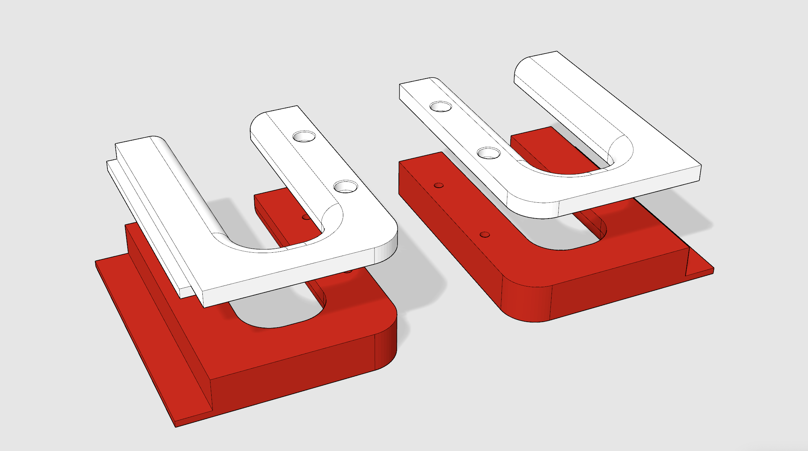

Maker Media GmbH

***

# Ikea-Minihacks (Printember 2025)

**Ich habe dieses Jahr eine Metod-Küche von Ikea gebaut. Dabei gab es immer wieder kleine Herausforderungen, die ich mithilfe von CAD und 3D-Druck gelöst habe.**

Hier findet ihr folgende Modelle im STL- und STEP-Format:
- **Kabelschoner:** Diese kleinen Adapter passen links und rechts hinten in einen Metod-Unterschrank. Sie runden die scharfe Kante der Rückseite ab.
- **Abstandhalter:** Da ich die Arbeitsplatte nahezu bündig abschließend auf die Unterschränke setzen wollte, musste ich die Schränke etwas von der Wand wegziehen. Die Abstandhalter haben dabei geholfen, dass sie nicht wieder zurückrutschen.
- **Sägehilfe:** Auf den Karslby-Arbeitsplatten verwende ich die Abschlussleisten Hansbyn. Da mir ein Werkzeug fehlte, um sie im 45-Grad-Winkel absägen zu können, habe ich mir eins gebaut.
- **Runde Abdeckung:** Nicht spektakulär, aber wenn man in die Rückwand der Metod-Schränke eine runde Aussparung sägt, ist sie mit 3D-dgedruckter Abdeckung etwas schöner.

Die Übersichtsseite zum Printember 2025 **[findet ihr hier](https://www.heise.de/hintergrund/Printember-24-grossartige-3D-Drucke-bis-Weihnachten-11097227.html)**. Dort findet ihr auch die Links zu unseren Social-Media-Kanälen und den Erklärungsvideos zu den Modellen.
